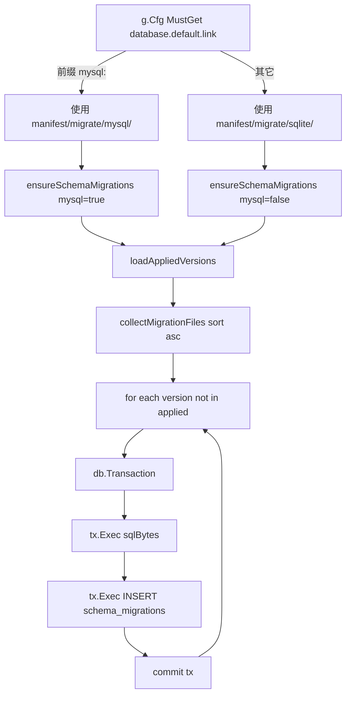

# itab-db-versioned-migrations 契约清单（MUST）

本文档是**机器可校验**的契约集：文件位置、文件名正则、SQL 语句原文、依赖禁令。任一条款被违反，视为偏离本技能，CI / code review 应拒绝。

与启动调用顺序相关的契约（`boot.Run` 内何时调用 `RunMigrations`）属 [itab-server/references/contracts.md](../../itab-server/references/contracts.md) 管辖，不在本文重复。

## 1. 落盘位置

| 路径 | 角色 |
|---|---|
| `server/manifest/migrate/sqlite/` | SQLite 方言版本化 SQL |
| `server/manifest/migrate/mysql/` | MySQL 方言版本化 SQL |
| `server/internal/boot/migrate.go` | 进程内迁移引擎；不得另起包或挪位置 |

**两方言目录必须同时存在**（至少一个 `.gitkeep`），否则切换 `DATABASE_DSN` 时 `RunMigrations` 立即返回 `migrate dir not found: ...`。

## 2. 迁移文件命名（MUST）

- 正则：`^(\d{6})_.*\.up\.sql$`（硬编码于 [../examples/internal/boot/migrate.go](../examples/internal/boot/migrate.go) 的 `migrationFileRe`）
- 版本号：6 位零填充递增，从 `000001` 起步；每次业务变更**同时**在 `sqlite/` 与 `mysql/` 加同一版本号的 `.up.sql`
- 两方言文件**语义一致**、语法可不同
- `.down.sql` 可提交作审计 / 人工回滚凭证；**`RunMigrations` 不识别、不执行**——不要期待自动回滚

**反例**（会被正则拒绝 / 不会执行）：

| 文件名 | 为什么不行 |
|---|---|
| `001_init.up.sql` | 版本号位数 < 6 |
| `000001-ledger.up.sql` | 分隔符必须 `_` |
| `000001_ledger.sql` | 缺 `.up` 后缀 |
| `000001_ledger.down.sql` | 不被执行（仅审计） |
| `ledger.up.sql` | 无版本号前缀 |

## 3. `schema_migrations` 表 DDL（MUST）

MySQL（来自 [../examples/internal/boot/migrate.go](../examples/internal/boot/migrate.go) `ensureSchemaMigrations`）：

```sql
CREATE TABLE IF NOT EXISTS schema_migrations (
  version bigint NOT NULL,
  dirty tinyint(1) NOT NULL,
  PRIMARY KEY (version)
) ENGINE=InnoDB DEFAULT CHARSET=utf8mb4
```

SQLite：

```sql
CREATE TABLE IF NOT EXISTS schema_migrations (
  version INTEGER NOT NULL PRIMARY KEY,
  dirty INTEGER NOT NULL DEFAULT 0
)
```

**不得**：

- 改列名 / 列顺序（会破坏与 golang-migrate 生态工具的互通）
- 加索引 / 加列（本表是内部簿记，越简单越好）
- 两方言用不同的列类型（SQLite `INTEGER` / MySQL `bigint` 已是两方言能表达的对等类型，不要统一）

## 4. 迁移应用语句（MUST）

每条迁移通过**一次事务**执行两句 SQL（见 [../examples/internal/boot/migrate.go](../examples/internal/boot/migrate.go) `RunMigrations`）：

```go
tx.Exec(string(sqlBytes))
tx.Exec(`INSERT INTO schema_migrations (version, dirty) VALUES (?, 0)`, mf.version)
```

**硬约束**：

| 约束 | 理由 |
|---|---|
| `dirty` 列插入值**硬编码 0** | 本实现不支持迁移中途失败的 `dirty=1` 标记回收；事务失败整条回滚，下次重试 |
| 两句 SQL 必须在**同一事务**内 | 避免"SQL 成功但 `schema_migrations` 没写"导致重复应用 |
| 已应用版本通过 `loadAppliedVersions` 幂等跳过 | 允许任意次重启，不重复执行 |

## 5. 依赖禁令

`server/go.mod` 内**不得**出现以下任一依赖：

- `github.com/golang-migrate/migrate`
- `github.com/golang-migrate/migrate/v4`
- `github.com/golang-migrate/migrate/.../database/...`（任何数据库驱动子包）
- `github.com/golang-migrate/migrate/.../source/...`（任何源驱动子包）

**检查**：

```bash
rg "golang-migrate/migrate" server/go.mod server/go.sum
# 预期：0 命中
```

## 6. 运行时禁令

- 业务 `Init` / `service` / `dao` 内**禁止** `CREATE TABLE` / `ALTER TABLE` / `DROP TABLE`。所有 DDL 只能通过新增 `000NNN_*.up.sql` 生效
- 不得把 `ensureSchemaMigrations` / 迁移执行逻辑移到 HTTP handler / 定时任务里；它属于**启动期**工作（由 [itab-server/references/bootstrap-wiring.md](../../itab-server/references/bootstrap-wiring.md) 管辖）
- 不得在代码中硬编码调试期 `DROP TABLE`（历史漂移复盘见 [itab-server/troubleshooting.md](../../itab-server/troubleshooting.md)）

## 7. 接口与数据流



方言选择**只影响**：

1. 迁移目录子路径（`sqlite` / `mysql`）
2. `schema_migrations` DDL（两种）

其它执行路径（事务、INSERT、文件扫描、排序）**完全共享**；不存在"MySQL 走 golang-migrate、SQLite 走 g.DB()"这种分叉。

## 8. 扩展一次业务变更的正确姿势

1. 在 `server/manifest/migrate/sqlite/000NNN_<desc>.up.sql` 写 SQLite 语法
2. 在 `server/manifest/migrate/mysql/000NNN_<desc>.up.sql` 写 MySQL 语法（版本号、语义与上条一致）
3. （可选）提交同编号 `.down.sql` 作审计；**不会被自动执行**
4. dev / test / prod 启动时自动应用；无需任何命令行动作

生成代码（若项目采用 `gf gen dao`）：在目标库已执行到对应版本的 `.up.sql` 之后再跑生成，确保生成物与真实库一致。
