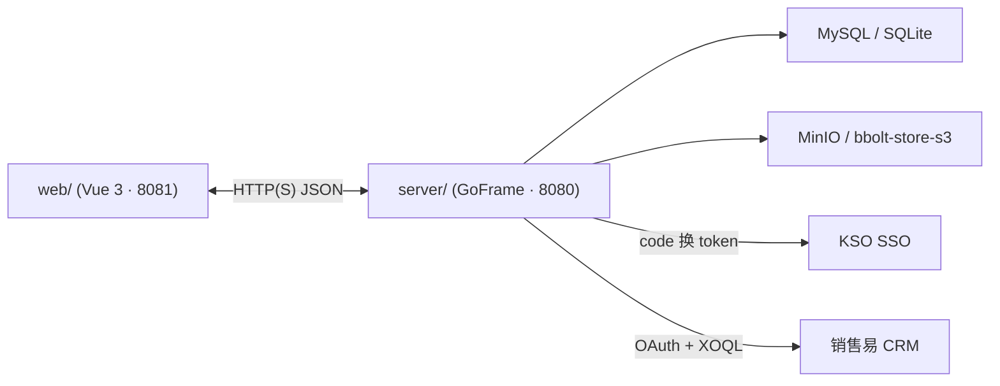

# 架构与边界

本文定义 `server/` 的对外边界与对内分层。任何改动**先**对齐本文，**再**动代码。

## 对外边界



- **`web/` ↔ `server/`**：只经 HTTP(S) 或约定通道；**无**共享磁盘、进程、数据库连接。
- **权威**：鉴权、业务规则、持久化以 `server/` 为准。`web/` 不得在 localStorage / 前端状态里"复刻"一套权限判断作为 source-of-truth。
- **不越界**：`server/` 不 serve 前端静态资源（除非运维层统一反代）；前端构建产物不落进 `server/` 仓库。

## 对内分层

```
server/
├── main.go                       ← 入口（仅 ApplyGFEnv + cmd.Main.Run）
├── internal/
│   ├── boot/                     ← 启动前置：配置展开 + 校验 + 迁移 + 数据目录
│   ├── cmd/                      ← gcmd 注册、路由注册、中间件挂载
│   ├── controller/<domain>/      ← HTTP 控制器；只做参数校验与 service 调用
│   ├── service/<domain>/         ← 业务逻辑；所有跨域规则在这一层
│   └── dao/                      ← gf gen dao 生成；直接读写 DB
├── api/<domain>/v1/              ← 请求 / 响应 struct；与前端契约
├── manifest/
│   ├── config/                   ← yaml 三份（dev/test/prod）
│   └── migrate/{sqlite,mysql}/   ← 版本化 SQL，两方言同版本号
└── data/                         ← dev 本地持久化（SQLite / bbolt-store-s3），gitignore
```

## 职责切分 vs 兄弟 skill

| 主题 | 负责 skill | server/ 的责任边界 |
|---|---|---|
| 登录 / SSO（`user_auth`） | [itab-kso-sso](../../itab-kso-sso/SKILL.md) | 在 `cmd.mainFunc` 里按 SSO skill 要求挂载中间件；不**并行实现**鉴权 |
| 数据库迁移 | [itab-db-versioned-migrations](../../itab-db-versioned-migrations/SKILL.md) | 只触发 `boot.RunMigrations`；SQL 写法 / schema_migrations 协议以迁移 skill 为准 |
| 文件对象存储 | [itab-file-object-storage](../../itab-file-object-storage/SKILL.md) | 只持有 `storage.default.*` 配置；上传 / 下载 / presign 接口以存储 skill 为准 |
| 销售易 CRM | [itab-xiaoshouyi-crm](../../itab-xiaoshouyi-crm/SKILL.md) | 只持有 `crm.xiaoshouyi.*` 配置；OAuth 与 XOQL 细节以 CRM skill 为准 |
| Go / GoFrame 实现约定 | [goframe-v2](../../goframe-v2/SKILL.md) | 遵守其约定（命名、错误处理、ORM 用法） |

## 禁止事项（来自真实事故）

- **在 `server/` 并行实现 SSO**：历史上出现过本地鉴权与 KSO SSO 双路径并存，导致绕过漏洞。全员 code review 拒绝。
- **在业务 `Init` 里建表**：必须走 `manifest/migrate/`。历史事故：生产环境漏建表，因为漏调 `RunMigrations`。
- **在 `controller` 层写业务规则**：`controller` 只做解码 / 校验 / 调 service / 编码。规则下沉到 `service`。
- **跨 domain 直接 import `dao`**：跨域调用必须经 `service`；否则重构成本爆炸。

## 端口与部署

| 用途 | 端口 | 约束 |
|---|---|---|
| 后端 HTTP | `:8080` | 三环境一致 |
| 前端开发 | `:8081` | 由 [itab-client](../../itab-client/SKILL.md) 负责 |
| MySQL（本地） | `:3306` | Docker 容器，root/123456，仅用于 test 联调 |
| MinIO（本地） | `:9000` | dev 走 `bbolt-store-s3`（嵌入式），不走真 MinIO |

联调 8081 → 8080 通常由 Vite proxy 或 whistle 转发，细节见 [itab-client](../../itab-client/SKILL.md) 与 [itab-kso-sso](../../itab-kso-sso/SKILL.md) 的 whistle 指南。

## 新增一个业务 domain 的顺序

1. 在 `api/<domain>/v1/` 定义请求 / 响应
2. 在 `manifest/migrate/{sqlite,mysql}/` 同步加迁移 SQL（同版本号）
3. 用 `gf gen dao` 生成 `internal/dao/<domain>/`
4. 写 `internal/service/<domain>/`
5. 写 `internal/controller/<domain>/` 并在 `cmd/cmd.go` 注册路由
6. 不要触碰 `internal/boot/`

触碰 `internal/boot/` **有且仅有** 以下正当理由：新增一个启动前置步骤（见 [bootstrap-wiring.md §新增启动前置步骤](bootstrap-wiring.md#新增启动前置步骤的姿势)）。

## 关联

- [contracts.md](contracts.md)
- [bootstrap-wiring.md](bootstrap-wiring.md)
- [env-and-config.md](env-and-config.md)
- [../troubleshooting.md](../troubleshooting.md)
