# 启动接线（强制）

本文件描述 `server/` 进程启动时 **必须** 的调用顺序与职责。顺序本身是契约，任何修改必须先更新 [contracts.md](contracts.md) 与 [../examples/server/](../examples/server/)。

## 调用图

```mermaid
flowchart TD
    M[main.main] --> AE["boot.ApplyGFEnv()"]
    AE --> AE1["① 读 manifest/config/config.&#123;env&#125;.yaml 原文"]
    AE1 --> AE2["② os.ExpandEnv 展开 ${VAR}"]
    AE2 --> AE3["③ gcfg.NewAdapterContent"]
    AE3 --> AE4["④ g.Cfg().SetAdapter"]
    AE --> GC["cmd.Main.Run(gctx.New())"]
    GC --> MF[cmd.mainFunc]
    MF --> BR["boot.Run(ctx) — 必须首行"]
    BR --> V["ValidateRequiredEnv(ctx)"]
    V -->|env=dev| OK1[跳过]
    V -->|test/prod 缺变量| F1["Fatal 并列出清单"]
    V -->|test/prod 通过| ESP["ensureSqliteParentDir(ctx)"]
    ESP --> RM["RunMigrations(ctx)"]
    RM --> PP["prefix = g.Cfg() server.pathPrefix"]
    PP --> BIZ["s.Group(prefix, ...) 路由注册"]
    BIZ --> SR["s.Run() :8080"]
```



## 分层职责

| 层 | 文件 | 职责 | 禁止 |
|---|---|---|---|
| ① 入口 | [main.go](../examples/server/main.go) | 先 `boot.ApplyGFEnv()`，再 `cmd.Main.Run(gctx.New())` | 在此处做业务 import 副作用 |
| ② 配置展开 | [boot/config_env.go](../examples/server/internal/boot/config_env.go) | 三步：选 yaml → 展开 `${VAR}` → 注入 AdapterContent | 访问数据库、业务 import |
| ③ 命令入口 | [cmd/cmd.go](../examples/server/internal/cmd/cmd.go) | 注册 `gcmd.Command`，`mainFunc` 首行调用 `boot.Run(ctx)`，然后从 `server.pathPrefix` 读取路由前缀 | `boot.Run` 之前放任何业务代码 |
| ④ 启动前置 | [boot/run.go](../examples/server/internal/boot/run.go) | 强校验 env → 建 SQLite 父目录 → 跑迁移 | 顺序颠倒；省略错误返回 |
| ⑤ 校验 | [boot/config_env.go](../examples/server/internal/boot/config_env.go) `ValidateRequiredEnv` | test/prod 下缺 `DATABASE_DSN` 或 link 非法 → Fatal | 降级为 warn |
| ⑥ 迁移 | [boot/migrate.go](../examples/server/internal/boot/migrate.go) | 读 `manifest/migrate/{sqlite|mysql}/`；按 `schema_migrations` 幂等执行 | 在业务 `Init` 里建表 |
| ⑦ 业务 | 各 `service.*Init` + 路由注册 | 在 `boot.Run` 成功后再执行 | 先注册路由再 `boot.Run` |
| ⑧ 服务 | `g.Server().Run()` | 监听 `:8080` | 改端口未同步文档 |

## 漏接某步的真实症状

| 漏掉 | 启动时症状 | 运行时症状 |
|---|---|---|
| ① `boot.ApplyGFEnv()` | 立即报 `invalid link configuration: ${DATABASE_DSN}` 或 `config.yaml not found` | — |
| ③.1 `ValidateRequiredEnv` | 无错，但空 DSN 传给驱动 | 连接失败，错误信息在 MySQL 驱动层，排查路径长 |
| ③.2 `ensureSqliteParentDir` | dev 首次启动报 `unable to open database file` | — |
| ③.3 `RunMigrations` | 无错 | 业务查询 `no such table: xxx` / `Unknown table 'db.xxx'` |
| ③ `boot.Run` 整体被 `s.Run()` 抢先 | 无错 | 所有依赖表 / 配置的查询都异常；复现间歇，最难排查 |

## 为什么 `ApplyGFEnv` 不放进 `boot.Run`

短答：**`boot.Run(ctx)` 的 `ctx` 由 GoFrame 通过 `gcmd.Command` 构造，构造过程可能触发 `g.Cfg()`**；而 `ApplyGFEnv` 必须早于 `g.Cfg()` 的首次读取。

因此 `main.go` 的形状就是固定的：

```go
func main() {
    boot.ApplyGFEnv()           // ← 必须在 gctx.New() 之前
    cmd.Main.Run(gctx.New())    // ← gctx.New() 内部可能读 g.Cfg()
}
```

把它移进 `boot.Run` 会让展开在某些 GoFrame 版本 / 配置下**时而生效、时而不生效**——典型的间歇性故障源。

## 为什么 `ValidateRequiredEnv` 必须是 `boot.Run` 第一行

它既校验 env，也校验**展开后**的 `database.default.link`。这意味着它必须在 `ApplyGFEnv` 之后（已经展开）、所有使用 DB 的代码之前（包括 `ensureSqliteParentDir` 读 link 与 `RunMigrations` 打开连接）。

`boot.Run` 第一行是这两个条件的唯一交集。

## 新增启动前置步骤的姿势

若需在 `boot.Run` 里加一步（例如 `EnsureStorageRoot`），插入**在 `RunMigrations` 之前**，并同步：

1. 更新 [contracts.md](contracts.md) 的「调用顺序」图
2. 更新本文件的调用图与分层职责表
3. 在 [../examples/server/internal/boot/run.go](../examples/server/internal/boot/run.go) 与主项目 `server/internal/boot/run.go` 同时加
4. Bump [../examples/server/README.md](../examples/server/README.md) 的 `version` 与主项目 baseline 注释

**禁止**：只改主项目、不改 examples；examples 先于主项目更新、主项目拖后腿。

## 关联

- [contracts.md](contracts.md)
- [env-and-config.md](env-and-config.md)
- [../troubleshooting.md](../troubleshooting.md)
