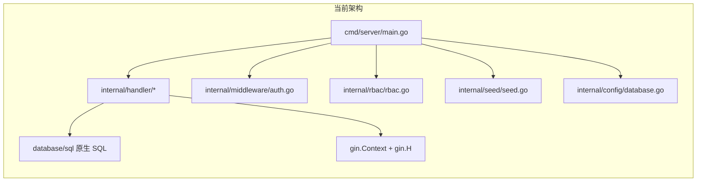
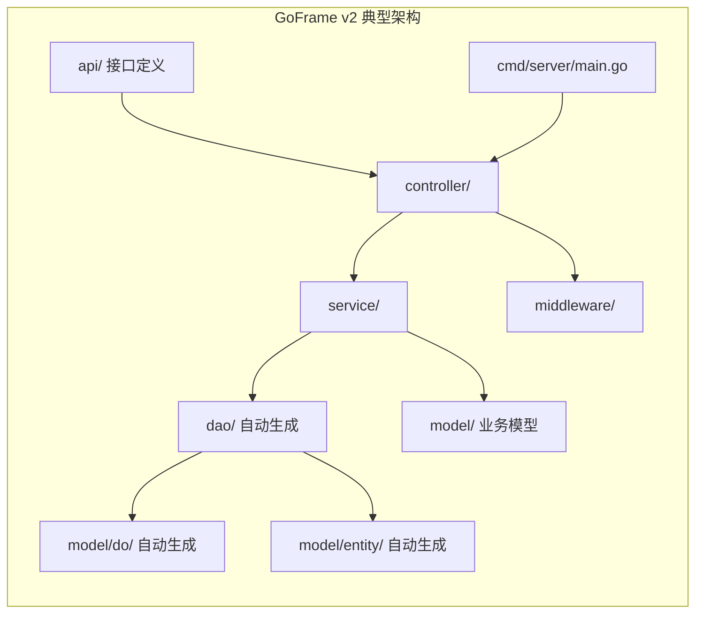

# Go 后端 vs GoFrame v2 规范 — 完整差距分析

本文档对照仓库内 [`.cursor/skills/goframe-v2/SKILL.md`](../../.cursor/skills/goframe-v2/SKILL.md) 中的约定，说明当前 `backend/` 实现与 GoFrame v2 的差异及可选演进方向。

## 现状总览

当前 `backend/` 为 **Gin + database/sql + SQLite** 的轻量服务（约十余个源文件），**未引入 GoFrame**（`go.mod` 中无 `github.com/gogf/gf`）。

> 说明：主力业务后端为仓库根目录下的 **Node.js `server/`**；`backend/` 为可选/实验性 Go 实现，与 Node 端功能未必完全对齐。

---

## 逐项差距对照

### 1. 框架与依赖

| 维度 | 当前实现 | GoFrame v2 规范 |
|------|----------|------------------|
| Web 框架 | `gin-gonic/gin` | `github.com/gogf/gf/v2` |
| ORM | `database/sql` 原生 SQL | `gdb`（GoFrame ORM） |
| 配置 | 环境变量 | `gcfg`（如 `manifest/config/config.yaml`） |
| 日志 | `gin.Logger()` | `glog` |
| 错误处理 | 裸 `error` / `gin.H{"error":...}` | `gerror`（堆栈与错误码） |

**结论**：技术栈层面不同，非「小改即可对齐」。

---

### 2. 项目脚手架（Skill：`gf init`）

- **当前**：手工目录结构，无 GoFrame CLI。
- **规范**：`gf init` 生成标准脚手架（含 `api/`、`controller/`、`service/`、`model/`、`dao/` 等）。

---

### 3. 分层架构

| 层级 | 当前 | GoFrame v2 规范 |
|------|------|------------------|
| API 定义 | 无；路由直接绑定 handler | `api/` 中定义请求/响应结构 |
| Controller | `internal/handler/*.go` 混合路由、业务、SQL | `controller/` 偏薄：校验 + 调 service |
| Service | 无 | `service/` 承载核心业务 |
| DAO | 无 | `dao/` 由工具生成，**禁止手写修改** |
| Model | 无统一 model 包 | `model/do/`、`model/entity/` 等 |

**结论**：业务与 SQL 集中在 handler，与 Skill 中「logic 默认不用、业务在 service」的分层目标不一致（当前连 service 层都没有）。

---

### 4. 数据库操作（Skill：必须用 DO，禁止 `g.Map`）

- **当前**：手写 SQL、`Scan`/`Exec`，辅助函数与 `map[string]interface{}` 解析（如 `internal/handler/helpers.go`）；DDL 在 `internal/config/database.go`。
- **规范**：通过 `dao` + `do` 更新，例如 `dao.Users.Ctx(ctx).Data(do.User{...}).Update()`。

**结论**：无 DO/Entity、无代码生成链路，与 Skill 硬性要求差距最大。

---

### 5. 错误处理（Skill：`gerror`）

- **当前**：`c.JSON(500, gin.H{"error": err.Error()})` 等，易暴露内部细节。
- **规范**：`gerror` + 错误码，便于链路追踪与统一响应。

---

### 6. 软删除与时间字段（Skill：自动维护）

- **当前**：表结构以现有 Node 侧 SQLite 为准为主，**未统一** GoFrame 推荐的 `deleted_at` 软删语义；时间字段依赖 SQL 默认值或手写更新。
- **规范**：表含 `created_at`/`updated_at`/`deleted_at` 时由 ORM 自动维护；`Delete()` 即软删。

---

### 7. 代码风格（Skill：`var` 块分组）

- **当前**：多处分散 `:=` 声明。
- **规范**：同一作用域内 3 个以上相关变量宜用 `var (...)` 分组。

**结论**：轻微风格差异，可独立渐进优化。

---

### 8. 配置管理

- **当前**：`os.Getenv` + README 表格。
- **规范**：`gcfg` + yaml，支持环境覆盖。

---

## 差距严重度汇总

| 差距项 | 严重度 | 影响范围 |
|--------|--------|----------|
| 框架不同（Gin vs GoFrame） | 根本性 | 全项目 |
| 无 api/controller/service/dao 分层 | 严重 | 全部业务代码 |
| 无 DO/Entity、原生 SQL | 严重 | 所有数据访问 |
| 无 `gerror` | 中等 | 全部 HTTP 层 |
| 无软删/ORM 时间维护约定 | 中等 | 表设计与访问层 |
| 无 `config.yaml` | 中等 | 配置与部署 |
| `var` 分组等风格 | 轻微 | 可读性 |

---

## 结论与建议

1. **若 `backend/` 仅为备用或对齐 Node API 的实验实现**：可保持 Gin + `database/sql` 现状；本仓库 Skill 中的 GoFrame 规范**不自动约束**该目录，除非团队明确选定 GoFrame 为 Go 侧标准。
2. **若计划将 Go 侧作为长期主后端**：更稳妥的做法是 **新建 GoFrame 工程**（`gf init`），按表结构生成 dao/do/entity，再迁移业务到 `service/`，而不是在现有 Gin handler 上「局部贴 GoFrame 标签」。
3. **工作量量级**：完整对齐 GoFrame v2 Skill 约等于 **重写** 当前 `backend/`（数千行量级），需单独排期与测试（含与 `server/` 行为一致性）。

---

## 文档维护

- 分析基准：`.cursor/skills/goframe-v2/SKILL.md`（随 Skill 更新可复审本文）。
- 代码路径：`backend/cmd/server/main.go`、`backend/internal/handler/`、`backend/internal/config/database.go` 等。
