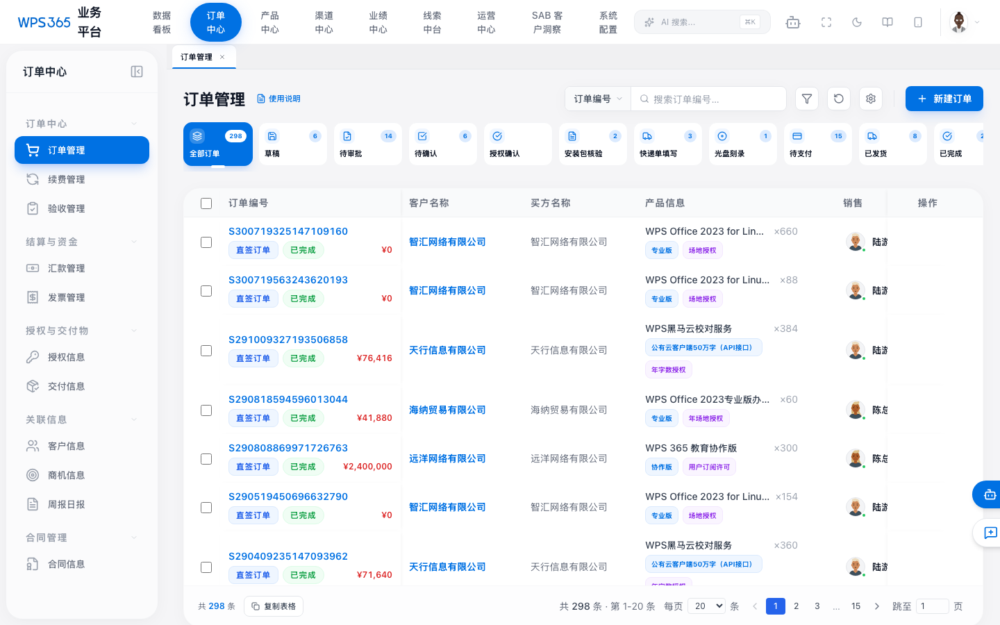
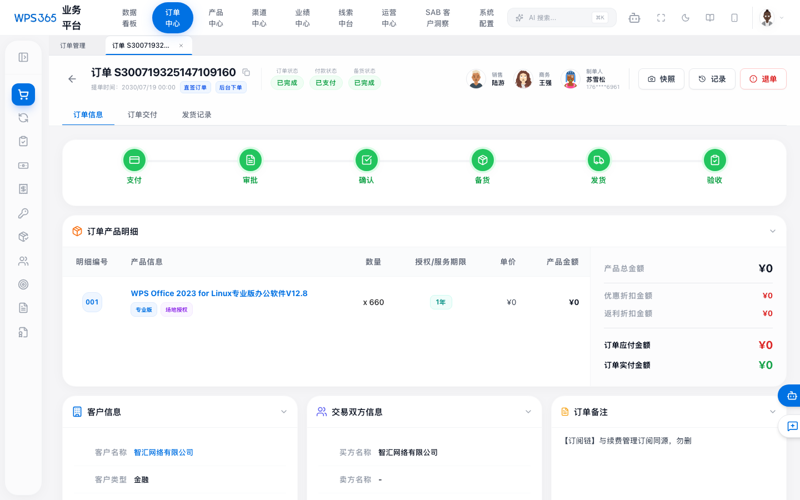
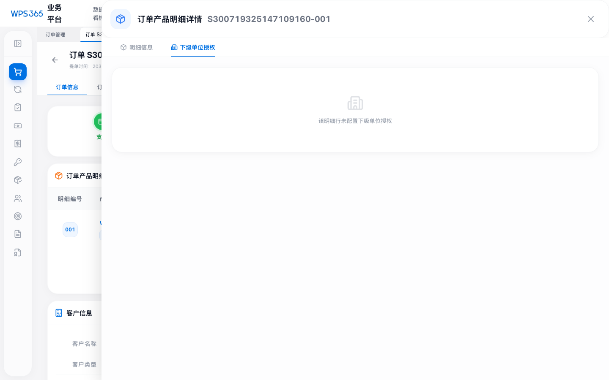

# 下级单位：新建订单与订单说明

本文档基于当前**业务平台**（`OrderCreateWizard`、`OrderDetails`、`OrderItemDetailsDrawer`、下级单位 CSV 等实现）整理，说明「下级单位」在**新建订单**与**订单详情**各处的含义、操作与约束，并配界面截图（本地 Mock 模式抓取）。

> **截图环境**：使用 `VITE_API_MODE=false` 启动 Vite 后，订单列表为本地 mock 全量数据；若使用 `VITE_API_MODE=true` 需先登录且后端有订单数据。截图文件位于与本文件同级的 `images/` 目录。重新生成可执行：  
> `VITE_API_MODE=false npm run dev -- --port 5176`（若端口被占用则看终端实际端口，如 `5177`）后，再执行 `VITE_DEV_URL=http://localhost:5176 node scripts/capture-subunit-screens.mjs`（将 URL 中的端口与终端一致）。截图脚本见 `scripts/capture-subunit-screens.mjs`。

---

## 1. 概念与数据

### 1.1 功能定位

- **下级单位**用于在部分授权场景下，将本订单某一产品行上的**席位/授权数**，按**多个子组织（下级单位）**进行拆分、登记联系人与企业信息。
- 行为由明细行上的 **下级单位授权模式**（`SubUnitAuthMode`）与多行 **下级单位**（`SubUnit[]`）共同描述，存储在**订单行**上（与主订单客户/买方信息区分）。

### 1.2 模式枚举 `SubUnitAuthMode`

| 内部值 | 页面文案 |
|--------|----------|
| `none` | 无下级单位（默认，不展示下级行表） |
| `separate_auth_separate_eid` | 授权分别呈现，企业ID分别管理 |
| `separate_auth_unified_eid` | 授权分别呈现，企业ID统一管理 |
| `unified_auth_with_list` | 授权和企业ID统一管理并提供下级清单 |

> 在 **订单产品明细行抽屉** 中，上述模式会以标签形式展示（见后文图 3）。

### 1.3 行对象 `SubUnit` 主要字段

与新建时表格、详情抽屉列一致，包括：单位名称、企业ID、企业名称、**授权数量**、IT 联系人、手机、**邮箱**、客户类型、行业线、卖方联系人等（`types.ts` 中 `SubUnit` 接口）。

---

## 2. 新建订单中的下级单位

### 2.1 入口与位置

- 进入 **订单管理 → 新建订单**，在 **第三步：选择/添加产品** 中，通过 **「添加产品」** 打开产品级联与规格选择。
- 在同一 **添加/编辑产品** 的区域内，位于「订购与授权」等配置下方，有 **「下级单位授权」** 区块（代码位置：`OrderCreateWizard.tsx` 中 `下级单位授权` 注释区）。

实现要点：

- 通过下拉选择 **无下级单位** 或上述三种 **授权模式** 之一；选择「无」会清空已填的下级行。
- 若模式不为「无」，可 **新增行**、**批量导入 CSV** 或 **下载模板**；表格中逐行选择 **客户下级单位名称**（与主单客户可区分的其他客户名）、在关联客户有企业列表时选择 **企业ID**、填写 **授权数量** 及联系方式等。

### 2.2 数量与校验

- 每一行有 **授权数量**；**所有下级单位的授权数之和** 应与**当前产品明细的购买数量**（数量）**一致**；界面会显示「合计 / 明细数量 / 是否匹配」的提示，不匹配时**不应提交**（提交前会再次校验，见主逻辑中对 `item.subUnits` 与 `item.quantity` 的比对）。

### 2.3 业务约束

- 开启 **非「无」的下级单位模式** 后，若存在「需下级单位授权」的业务规则，订单可能 **仅允许一个产品明细行**（新建界面会限制再添加多行产品，并给出 `title` 提示；具体以 `enableSubUnitAuth` 等逻辑为准）。用于避免一张单内多套下级拆分规则混用难以核对。

### 2.4 CSV 批量导入

- **模板**表头为：`客户下级单位名称, 企业ID, 企业名称, 授权数量, IT联系人, 手机, 邮箱, 客户类型, 行业条线, 卖方联系人`（见 `subUnitCsv.ts` 中 `SUB_UNIT_CSV_HEADERS` 与 `downloadSubUnitTemplate`）。
- 解析时根据客户名称在 **客户主数据** 中匹配，**回填**客户类型、行业条线等（若与主数据一致）。

> **与详情展示的关系**：新建时编辑的表结构，与订单详情中 **产品行抽屉 → 下级单位授权** 的表格**列与语义一致**，见 **图 3**；因此新建界面的截图在本地完成「添加产品 + 选规格 + 再截屏」后，与图 3 布局相同，本文未单独重复截图。

---

## 3. 订单详情中的下级单位

### 3.1 订单产品明细表

- 在订单详情主区域 **「订单产品明细」** 中，可点击行上的 **明细编号**（如 `001` 按钮形）打开 **单条产品行抽屉**。



*图 1：订单列表（可点击订单号进入详情）*



*图 2：订单详情中「订单产品明细」与金额汇总等（可点击行号进入明细）*

### 3.2 行抽屉：信息 / 下级单位授权

抽屉顶部有两个 Tab：

- **明细信息**：本行产品、价格、数量、安装包与激活等（含「是否按下级单位提供授权」等字段的展示，若订单数据含 `subUnitLicenseAllowed`）。
- **下级单位授权**：与新建时**同套模式标签 + 表格**；有数据时 Tab 上显示**数量角标**。

若该行曾配置过下级单位模式，则显示模式名称标签及完整表格；底部有 **条数** 与 **各下级授权数合计与明细行数量** 的比对，一致为**绿色**，否则为**红色**。



*图 3：单产品行抽屉 → **下级单位授权** Tab，含模式说明与行列表*

若该行**未**配置下级单位，则本 Tab 中展示「该明细行未配置下级单位授权」的占位说明。

### 3.3 其它：证书/服务预览等场景中的「下级单位清单」

- 在部分**证书或服务信息预览**（`OrderDetails` 中 `isCertPreviewMode` 相关区）的 **「其他」** 小节，有一行 **「下级单位清单:」** 的汇总：展示全订单**下级行总数**，以及**分布在多少条产品明细**上。  
- 与主列表直接对比：主列表的订单行上**不单独展示**下级行条数，需进 **产品行抽屉** 或该预览区查看。

---

## 4. 与产品侧配置的关系

在 **产品/License 类型** 等配置中，可存在与「**按下级单位分开提供授权**」相关的能力位（`LicenseTypeManager` 等），代表该产品**允许**在订单中按下级单位拆授权。实际是否填写下级单位仍由**订单行**的 `subUnitAuthMode` / `subUnits` 与前台校验完成。

---

## 5. 如何自行补充「新建订单」步骤截图

若需与图 3 并列的**新建向导**截图，建议操作：

1. 使用 `VITE_API_MODE=false` 保证列表与数据为本地 mock。  
2. 打开 **新建订单**，按向导完成**买方/客户/产品**等必填，进入 **添加产品** 并选择**至少一个 SKU/计价项**，使 **「加入清单」** 可用。  
3. 加入清单后，在第三步编辑区**向下滚动**到 **「下级单位授权」**，与图 3 对照即可。  

也可在仓库中运行（需本机 5176 端口、Mock 已启动）：

```bash
VITE_API_MODE=false npm run dev -- --port 5176
# 另开终端
node scripts/capture-subunit-screens.mjs
```

当前自动化脚本在「级联选品到可点加入清单」一步因需完整选择 SKU/计价，可能未完成第四张图；**图 3 已能代表**表格与模式展示。

---

## 6. 相关源文件（便于联调）

| 内容 | 路径 |
|------|------|
| 行类型、模式定义 | `types.ts`（`SubUnit`, `SubUnitAuthMode`） |
| 新建：下级区 UI 与逻辑 | `components/order/OrderCreateWizard.tsx` |
| CSV 解析/模板 | `components/order/wizard/subUnitCsv.ts` |
| 行级 hook | `components/order/wizard/useItemSubUnits.ts`、 `useTempSubUnits.ts` |
| 详情：行抽屉 | `components/order/OrderItemDetailsDrawer.tsx` |
| 详情：主单（含证书预览汇总） | `components/order/OrderDetails.tsx` |

---

*文档生成时对齐仓库逻辑；若后续 UI 或字段有迭代，以代码为准并建议更新本页截图与表格。*
