# 新建订单功能测试报告

## 测试环境

| 项目 | 内容 |
|------|------|
| 应用地址 | http://localhost:5173/ |
| 测试日期 | 2026-03-11 |
| 测试轮次 | 2 轮 |
| 当前用户 | 张伟 (Admin) |

---

## 测试流程与截图

### 第一轮测试

#### Step 1 — 首页

- 显示数据看板（Dashboard），包含关键指标卡片与图表
- 顶部导航栏可见：数据看板 / 订单中心 / 产品中心 等 Tab

#### Step 2 — 订单列表
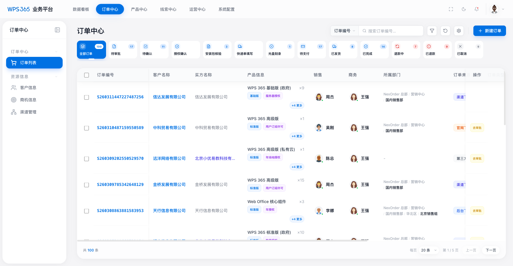
- 路径：点击顶部「订单中心」进入 `/#/orders`
- 右上角显示「新建订单」按钮（需拥有 `order_create` 权限）

#### Step 3 — 打开新建订单弹窗（Step 1：来源与销售模式）
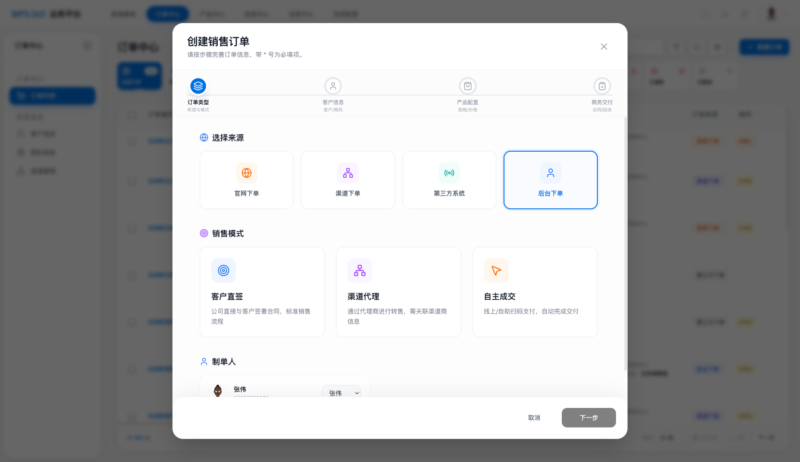
- 弹出「创建销售订单」向导
- 选择：订单来源 = **后台下单**，销售模式 = **客户直签**

#### Step 4 — 选择客户（填写前 / 填写后）
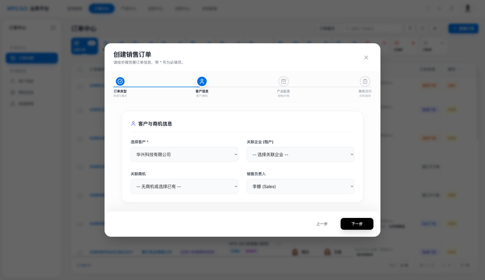
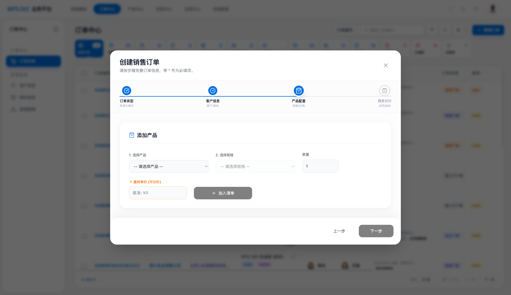
- 选择客户后自动带出：销售负责人、开票抬头、纳税人识别号

#### Step 5 — 添加产品（加入前 / 加入后）
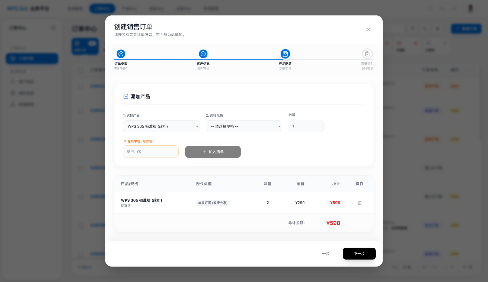
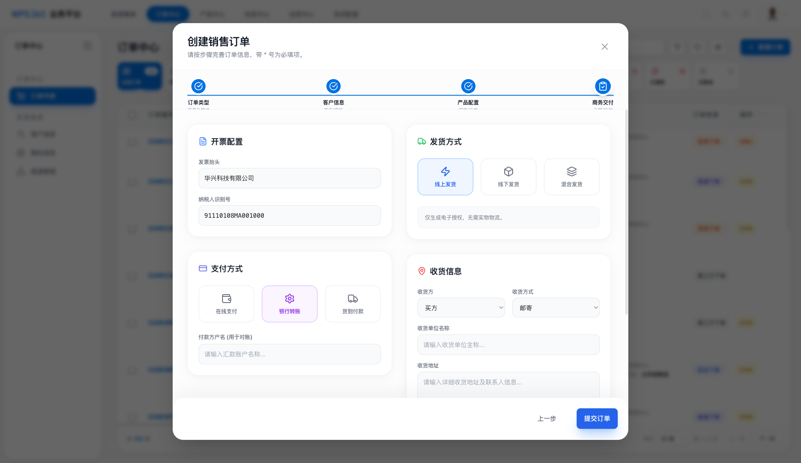
- 选择：产品 → 规格 → 授权类型 → 数量，点击「加入清单」
- 加入后商品出现在订单明细中

#### Step 6 — 开票与交付配置

- 发票信息自动带出，可调整支付方式与交付方式

#### Step 7 — 订单创建成功

- 提交后跳转至新订单详情页，信息与填写内容一致

#### Step 8 — 订单列表（含新订单）
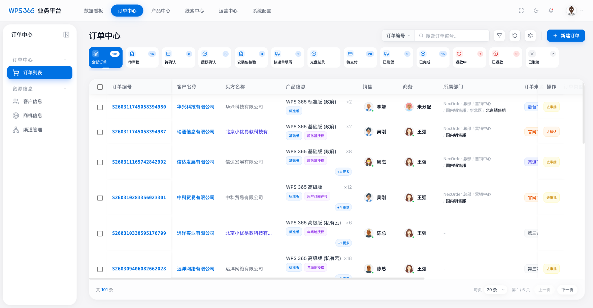
- 新订单出现在列表首位，总数 +1

---

### 第二轮测试

| 截图 | 步骤说明 |
|------|---------|
| 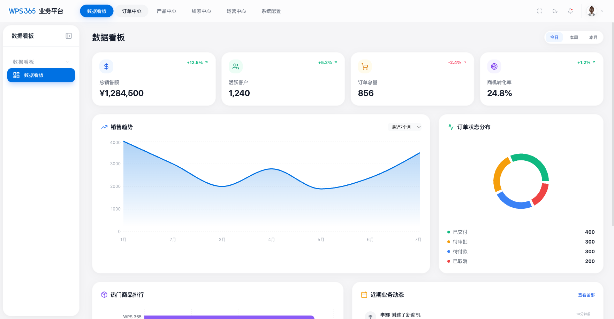 | 首页 |
| 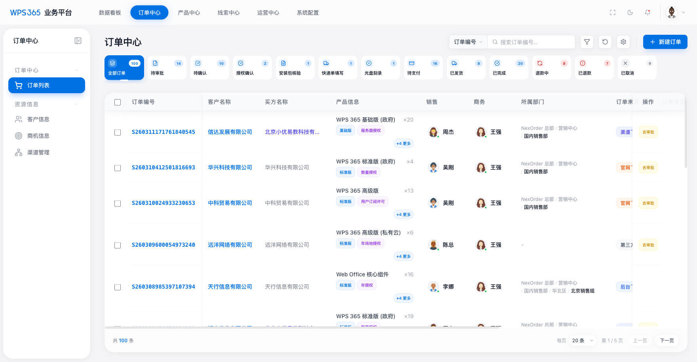 | 订单列表 |
| 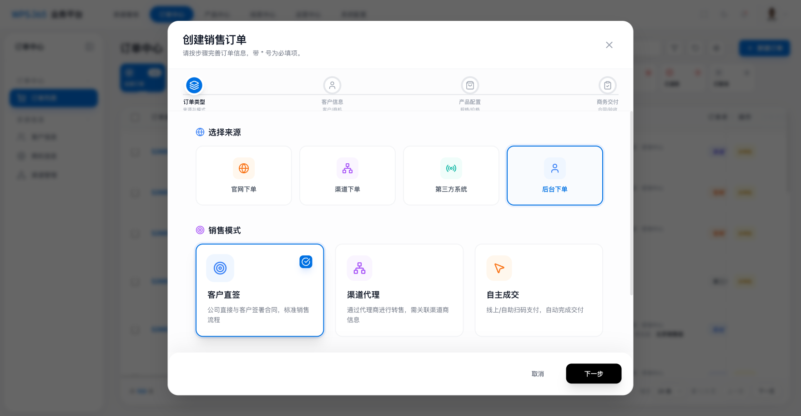 | 新建订单弹窗打开 |
| 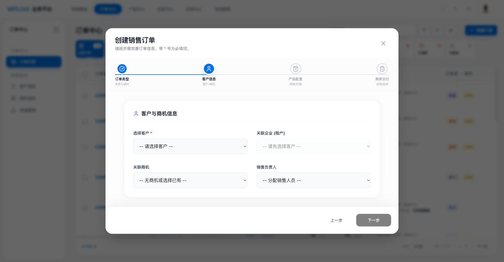 | Step 1 填写完成 |
| 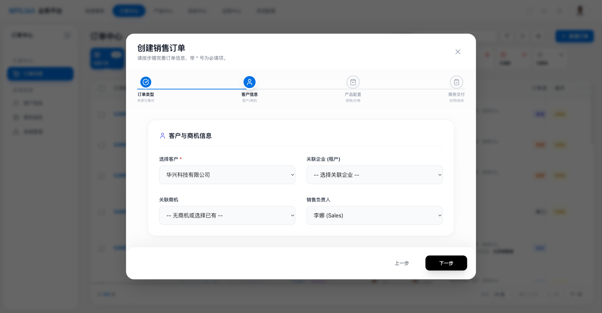 | Step 2 选客户前 |
| 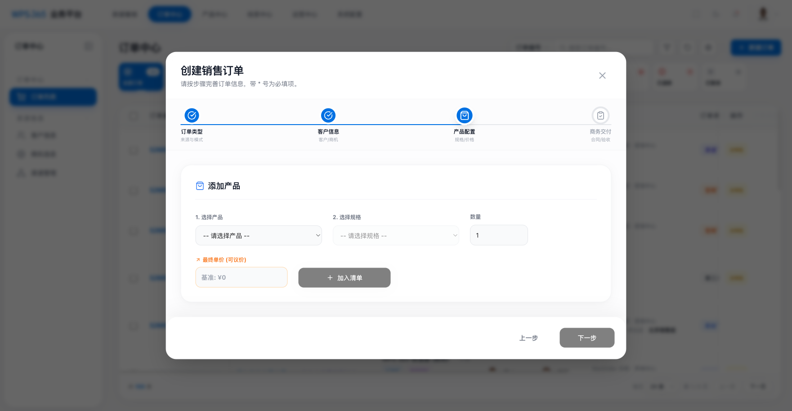 | Step 2 选客户后 |
|  | Step 3 添加产品前 |
| 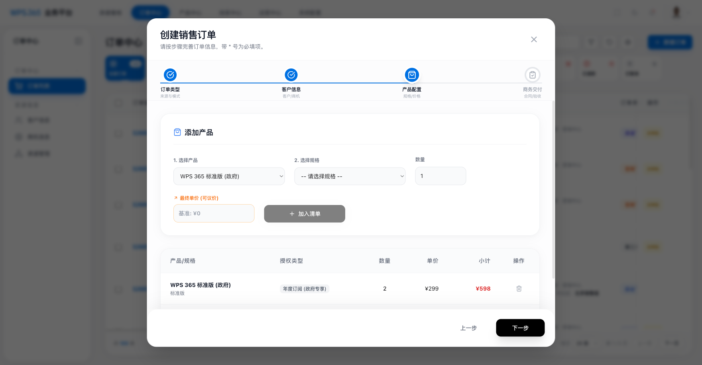 | Step 3 产品填写中 |
| 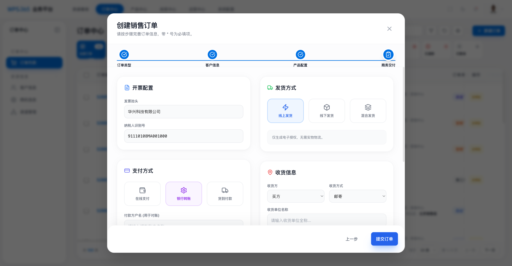 | Step 3 加入清单后 |
| 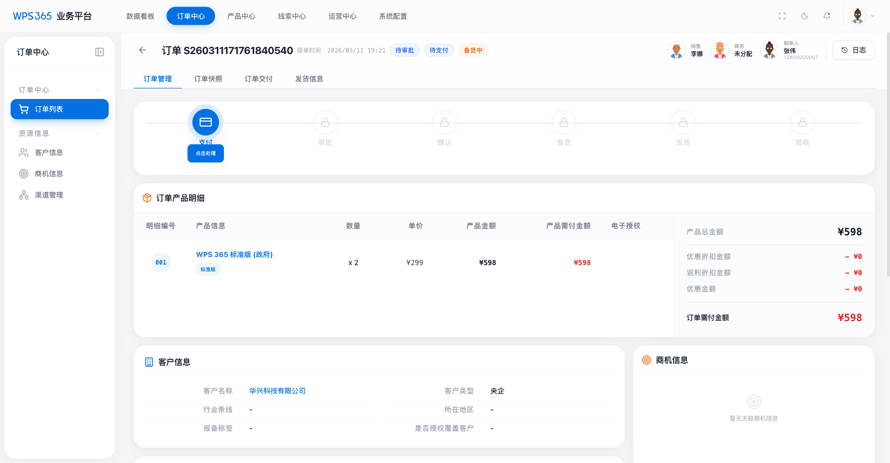 | Step 4 开票交付 |
| 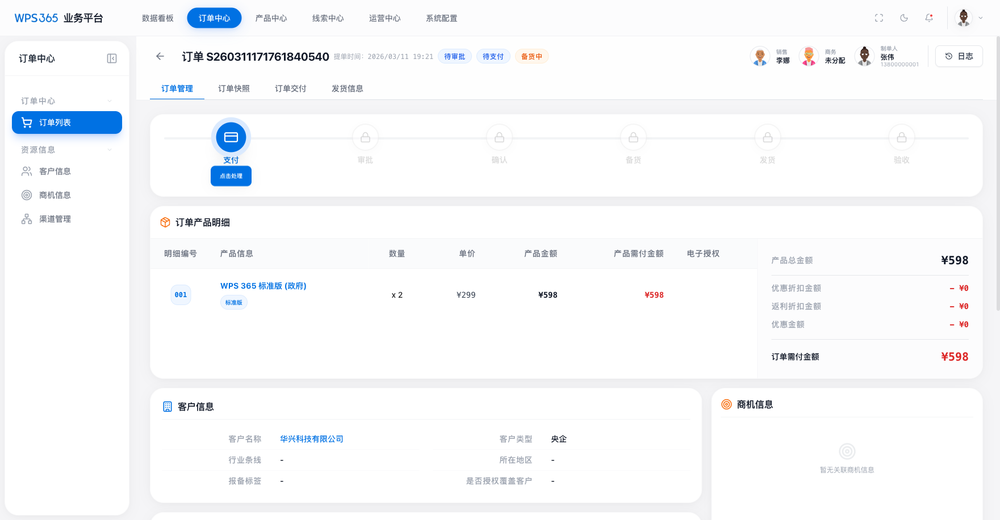 | 订单创建成功 |

---

## 测试结论

| 测试项 | 结论 |
|--------|------|
| 新建订单入口 | ✅ 订单列表右上角，需 `order_create` 权限 |
| 4 步向导流程 | ✅ 来源 → 客户 → 产品 → 开票交付，结构清晰 |
| 必填项校验 | ✅ 客户、产品、销售模式未填写时禁止提交 |
| 数据自动带出 | ✅ 选客户后自动填充开票信息、联系人 |
| 订单创建 & 跳转 | ✅ 创建成功后跳转至详情页，列表同步更新 |

---

## 发现的问题

### ⚠️ 订单 ID 格式不一致
- 新建订单 ID 格式：`S00000001`（8 位递增）
- 现有 Mock 数据格式：`S260311...`（日期 + 随机数）
- 影响：排序、查询或 ID 展示可能出现异常

### ⚠️ 授权类型提示不够明显
- 部分产品有 `pricingOptions`，未选择时点击「加入清单」仅弹出 `alert`
- 建议改为内联错误提示，减少用户困惑

### ℹ️ 分阶段验收百分比限制
- 选择「分阶段验收」时，各阶段百分比之和必须为 100%
- 当前通过 `alert` 提示，体验可进一步优化

---

## 用户体验评价

**优点：**
- 向导式 4 步流程结构清晰，步骤划分合理
- 选客户后自动带出开票、负责人等信息，减少重复填写
- 支持多种销售模式（客户直签 / 渠道代理 / 自主成交）
- 提交后自动跳转详情页，反馈及时

**建议改进：**
- 必填字段未填时的错误提示改为内联显示，替代 `alert` 弹框
- 授权类型选项加入引导文案或 tooltip 说明
- 新建订单的 ID 生成规则与现有数据格式保持统一
