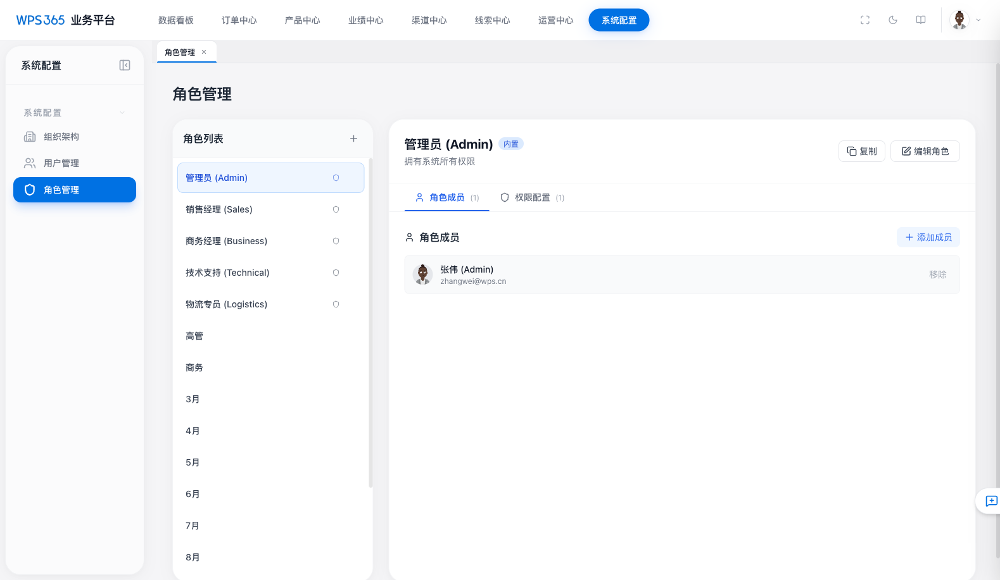
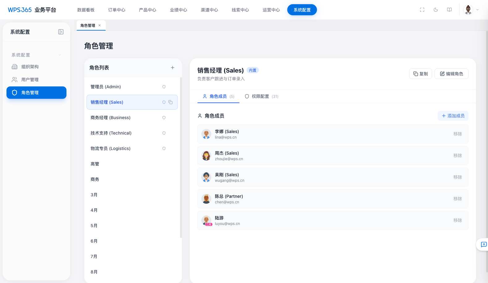
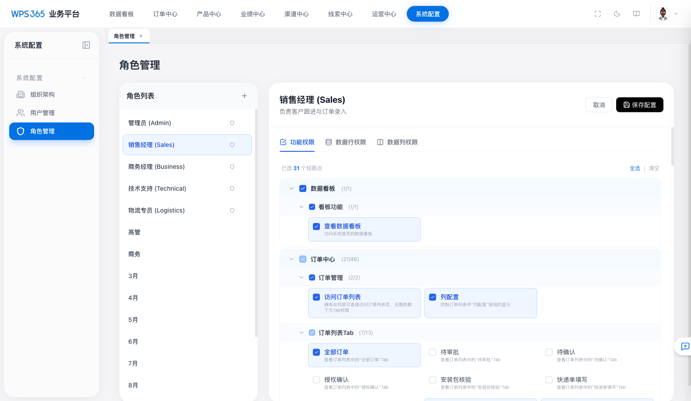
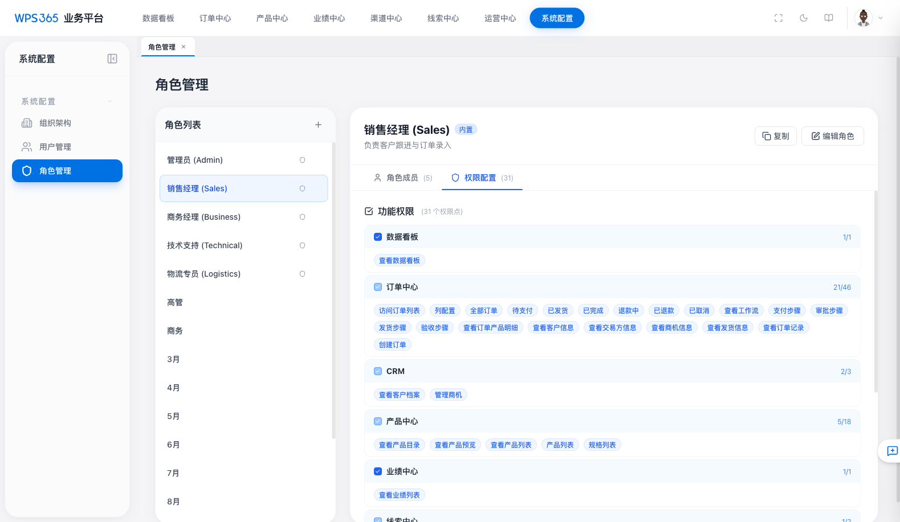
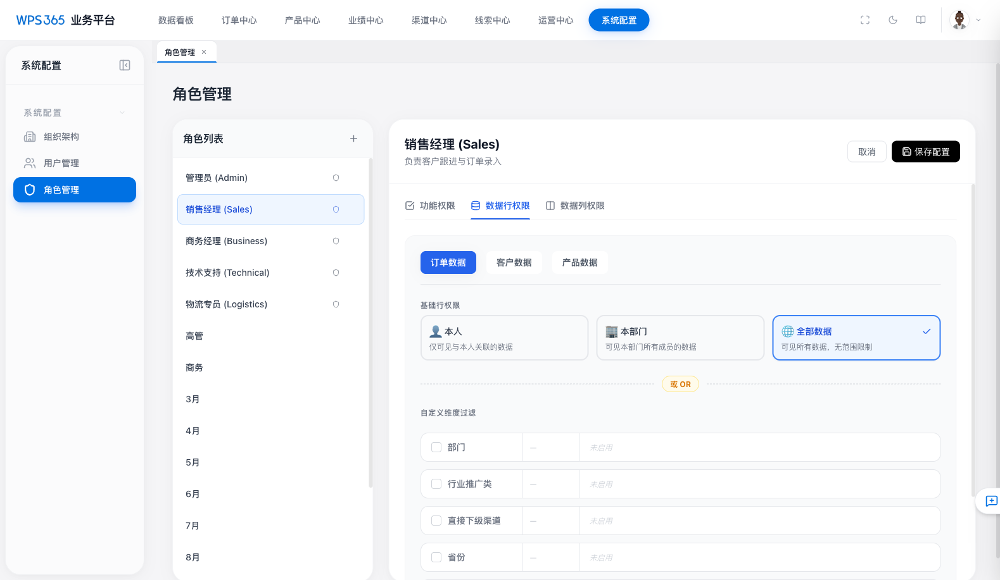
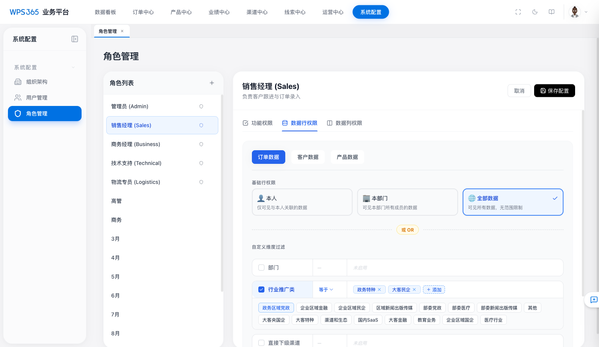
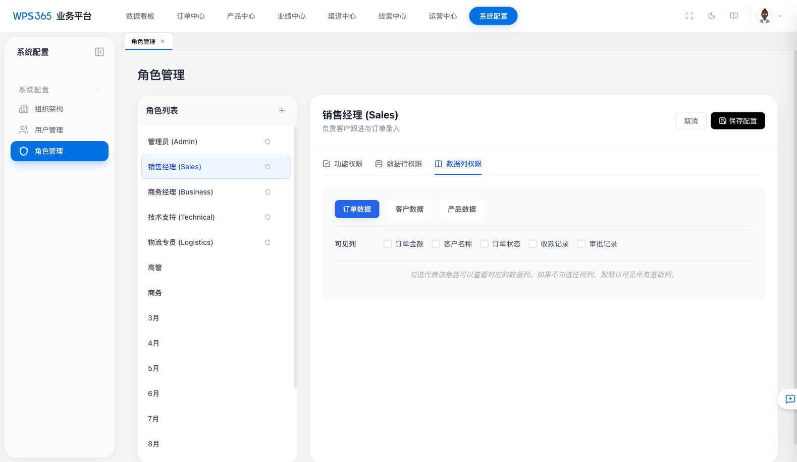

# WPS365 业务平台 - 权限管理功能 PRD

> **文档版本**：v1.0  
> **更新日期**：2026-03-19  
> **所属模块**：系统配置 > 角色管理  

---

## 1. 功能概述

权限管理是业务平台的核心基础功能，采用 **RBAC（基于角色的访问控制）** 模型，通过为角色配置三维权限（功能权限 + 数据行权限 + 数据列权限），再将用户分配到角色，实现精细化的访问控制。

### 1.1 核心能力

| 能力 | 说明 |
|------|------|
| 角色管理 | 创建、编辑、复制、删除角色 |
| 功能权限 | 控制用户可访问的菜单、页面、操作按钮 |
| 数据行权限 | 控制用户可见的数据记录范围 |
| 数据列权限 | 控制用户可见的数据字段 |
| 角色成员管理 | 将用户分配到角色、从角色移除 |

### 1.2 权限架构图

```
用户 ──→ 角色 ──┬──→ 功能权限（菜单/页面/操作）
                ├──→ 数据行权限（基础范围 OR 自定义维度过滤）
                └──→ 数据列权限（字段级可见性）
```

---

## 2. 角色管理

### 2.1 角色列表



**功能说明**：

- 左侧展示角色列表，支持内置角色（标记为"内置"）和自定义角色
- 内置角色（系统角色）不可删除，但可编辑权限配置
- 支持通过 "+" 按钮创建新角色
- 每个角色卡片 hover 时显示复制/删除操作按钮

**预置系统角色**：

| 角色 | 说明 |
|------|------|
| 管理员 (Admin) | 拥有系统所有权限（超级管理员） |
| 销售经理 (Sales) | 负责客户跟进与订单录入 |
| 商务经理 (Business) | 负责合同审批与收款确认 |
| 技术支持 (Technical) | 负责生产授权与安装包 |
| 物流专员 (Logistics) | 负责发货与物流跟踪 |

此外还有高管、商务、月份角色（3月~12月）等自定义角色，用于模拟渐进式权限开放。

### 2.2 角色详情 - 成员 Tab



**功能说明**：

- 角色详情分为 **角色成员** 和 **权限配置** 两个 Tab
- "角色成员" Tab 展示该角色下的所有用户
- 支持"添加成员"和"移除"操作
- 每条成员记录显示头像、姓名（含角色标签）和邮箱

### 2.3 角色复制

- 点击角色卡片上的"复制"按钮可深度复制一个角色
- 复制内容包括：功能权限列表、行权限规则、列权限规则
- 新角色名称自动追加 `(副本)` 后缀
- 复制后的角色标记为非系统角色（可删除）
- 自动进入编辑模式

---

## 3. 功能权限

### 3.1 权限树结构



功能权限采用 **三级树结构**：

```
模块组 → 子模块 → 权限点
```

**完整模块组清单**：

| 模块组 | 子模块数 | 权限点总数 | 说明 |
|--------|----------|-----------|------|
| 数据看板 | 1 | 1 | 首页数据看板访问 |
| 订单中心 | 8 | 46 | 订单列表/Tab/工作流/详情/操作/汇款/发票/收款/备货发货 |
| CRM | 2 | 3 | 客户档案、商机管理 |
| 履约信息 | 3 | 4 | 合同、授权、交付信息 |
| 渠道中心 | 1 | 2 | 渠道查看与编辑 |
| 产品中心 | 5 | 18 | 产品目录/列表/Tab/管理扩展/报价 |
| 业绩中心 | 1 | 1 | 业绩列表查看 |
| 线索中心 | 1 | 2 | 线索查看与管理 |
| 运营中心 | 1 | 1 | 运营功能访问 |
| 系统配置 | 1 | 4 | 管理员视图/用户/角色/组织架构管理 |
| 超级权限 | 1 | 1 | 超级管理员（All）覆盖所有权限 |

### 3.2 编辑交互

- 每个权限点显示名称 + 描述，使用复选框勾选
- 已选权限以蓝色勾选图标标识
- 顶部显示 "已选 X 个权限点" 计数器
- 提供 **全选 / 清空** 快捷操作
- 子模块支持展开/折叠
- 部分子模块有 `dependsOn` 依赖关系（如"产品列表Tab"依赖"查看产品列表"权限）

### 3.3 只读展示



- 按模块组分组展示，每组显示"X/Y"（已授权/总数）
- 已授权的权限点以蓝色标签展示
- 全部授权的模块组前显示蓝色实心勾选图标

---

## 4. 数据行权限

### 4.1 整体设计

数据行权限由两部分组成，二者为 **"或 (OR)"** 的关系：

```
可见数据 = 基础行权限范围 OR 自定义维度过滤匹配的数据
```

### 4.2 基础行权限



| 选项 | 规则 | 适用场景 |
|------|------|---------|
| 本人 | 仅可见数据中"创建人/负责人"为当前用户的记录 | 普通销售只看自己的订单 |
| 本部门 | 可见本部门所有成员创建/负责的数据 | 部门经理查看本部门数据 |
| 全部数据 | 无范围限制，可见所有数据行 | 管理员/高管角色 |

默认值为 **"全部数据"**。

### 4.3 自定义维度过滤



**支持的数据资源**：

| 资源 | 可配维度 |
|------|---------|
| 订单数据 | 部门、行业推广类、直接下级渠道、省份、订单类型 |
| 客户数据 | 部门、行业推广类、直接下级渠道、省份 |
| 产品数据 | 部门、行业推广类、直接下级渠道、省份 |

**各维度枚举值来源**：

| 维度 | 枚举来源 | 示例 |
|------|---------|------|
| 部门 | 组织架构树（显示完整层级路径） | NexOrder 总部 / 营销中心 / 国内销售部 |
| 行业推广类 | 系统预定义 18 项 | 政务特种、大客民企、企业区域金融、教育业务 等 |
| 直接下级渠道 | 渠道列表（动态） | 上海万企明道软件有限公司、武汉思行科技发展有限公司 等 |
| 省份 | 全国 34 个省级行政区 | 北京市、上海市、广东省、四川省 等 |
| 订单类型 | 系统预定义 5 项 | 新购订单、续费订单、增购订单、降配订单、退款订单 |

**编辑交互**（左-中-右三栏布局）：

| 区域 | 内容 | 操作 |
|------|------|------|
| 左侧 | 勾选框 + 维度名称 | 点击开关维度；启用时蓝色高亮 |
| 中间 | 关系运算符下拉 | 选择"等于"或"包含" |
| 右侧 | 已选值标签 + "添加"按钮 | 点击添加展开枚举面板选值；标签上×删除值 |

**运算符说明**：

| 运算符 | 语义 | 示例 |
|--------|------|------|
| 等于 | 数据字段值精确匹配选中枚举项之一 | 省份 等于 [北京市, 上海市] → 只看这两个省的数据 |
| 包含 | 数据字段值包含选中枚举项 | 行业推广类 包含 [政务] → 匹配含"政务"的所有行业推广类 |

### 4.4 行权限只读展示

在权限配置只读 Tab 中：

- 先显示 **基础范围** 标签（本人/本部门/全部数据），带颜色区分
- 然后通过"或 OR"分隔线
- 下方按资源分组展示自定义维度规则
- 每条规则显示：维度名称 + 运算符标签（等于/包含） + 值标签列表

---

## 5. 数据列权限

### 5.1 概述



数据列权限控制角色成员在查看数据记录时，哪些字段/列是可见的。

### 5.2 支持的资源与可控列

| 资源 | 可控列 |
|------|--------|
| 订单数据 | 订单金额、客户名称、订单状态、收款记录、审批记录 |
| 客户数据 | 联系人信息、开票信息、客户等级 |
| 产品数据 | 产品价格、规格列表、组件构成、安装包信息、权益信息 |

### 5.3 编辑交互

- 顶部资源切换按钮（订单数据 / 客户数据 / 产品数据）
- 以复选框列表展示可控列
- 勾选代表该角色可以查看对应列
- **默认规则**：如果不勾选任何列，则默认可见所有基础列

### 5.4 只读展示

- 按资源分组，使用紫色标签展示已授权可见的列
- 未配置时显示"未配置数据列权限，默认可见所有基础列"

---

## 6. 用户与角色的关联

### 6.1 用户归属角色

- 每个用户归属一个角色
- 用户继承所属角色的全部权限配置（功能 + 行 + 列）
- 在角色详情的"角色成员"Tab 可管理用户归属

### 6.2 用户详情中的权限展示

在用户管理页面点击用户后，侧边栏展示该用户所属角色的权限摘要：

- **数据行权限**：显示基础范围标签 + 自定义维度规则
- **数据列权限**：按资源显示可见列标签

---

## 7. 数据模型

### 7.1 角色定义 (RoleDefinition)

```typescript
interface RoleDefinition {
    id: string;
    name: string;
    description: string;
    permissions: string[];          // 功能权限点 ID 列表
    isSystem?: boolean;             // 系统角色不可删除
    baseRowPermission?: 'self' | 'department' | 'all';
    rowPermissions?: RowPermissionRule[];
    columnPermissions?: ColumnPermissionRule[];
}
```

### 7.2 行权限规则 (RowPermissionRule)

```typescript
interface RowPermissionRule {
    id: string;
    resource: 'Order' | 'Customer' | 'Product';
    dimension: PermissionDimension;
    operator: 'equals' | 'contains';
    values: string[];
}
```

### 7.3 列权限规则 (ColumnPermissionRule)

```typescript
interface ColumnPermissionRule {
    id: string;
    resource: 'Order' | 'Customer' | 'Product';
    allowedColumns: string[];
}
```

---

## 8. 业务规则汇总

| # | 规则 | 说明 |
|---|------|------|
| 1 | 系统角色不可删除 | isSystem=true 的角色无删除按钮 |
| 2 | 有用户的角色不可删除 | 需先移除所有成员 |
| 3 | 超级管理员权限覆盖一切 | permissions 包含 'all' 时拥有全部功能权限 |
| 4 | 基础行权限与自定义维度为 OR 关系 | 满足任一即可见 |
| 5 | 自定义维度之间为 AND 关系 | 同一资源下多个维度规则取交集 |
| 6 | 列权限未配置时默认全部可见 | 空列表等同于全部授权 |
| 7 | 功能权限支持依赖关系 | 取消父权限自动级联取消子权限 |
| 8 | 角色复制包含全部权限配置 | 深度复制功能/行/列权限 |

---

## 9. 页面导航路径

| 页面 | 路径 | 说明 |
|------|------|------|
| 角色管理 | `/#/roles` | 角色列表与详情 |
| 用户管理 | `/#/users` | 用户列表与详情 |
| 组织架构 | `/#/organization` | 部门层级管理 |

---

## 附录：截图清单

| 编号 | 文件名 | 说明 |
|------|--------|------|
| 01 | 01-role-list.png | 角色列表页 |
| 02 | 02-role-detail-members.png | 角色详情 - 成员 Tab |
| 03 | 03-permission-overview.png | 权限配置只读展示 |
| 04 | 04-functional-permission-edit.png | 功能权限编辑模式 |
| 05 | 05-row-permission-edit.png | 数据行权限编辑（初始状态） |
| 05b | 05b-row-permission-with-values.png | 数据行权限编辑（带维度值） |
| 06 | 06-column-permission-edit.png | 数据列权限编辑 |
| 07 | 07-permission-readonly-with-data.png | 权限配置只读（带行权限数据） |
